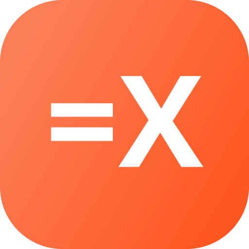

# 🧮 Simple & Friendly Calculator App 🖥️

Welcome to the Simple & Friendly Calculator App This app is designed to bring simplicity and ease to your everyday calculations, all wrapped up in a friendly and intuitive interface. Whether you're balancing your budget, solving math problems, or just curious about numbers, this app has got you covered!

## Features 🎯

- **Basic Arithmetic Operations**: Perform addition, subtraction, multiplication, and division with ease.
- **Percentage Calculation**: Quickly find percentages with a single tap.
- **Clear Screen**: Easily reset your screen with a single button.
- **Backspace Functionality**: Remove the last entered character with a swipe.

## Getting Started 🚀

To start using the Simple & Friendly Calculator App, clone the repository and open the `index.html` file in your preferred web browser. That's it You're all set to perform calculations.

## Contributing 🤝

Contributions are welcome If you have a feature request or bug report, please open an issue. Pull requests are also encouraged for improvements and additional features.

## Contact 📫

For any inquiries or support, please reach out to <a href="https://github.com/iam-aydin">iam-aydin</a> or visit the project's GitHub page.

